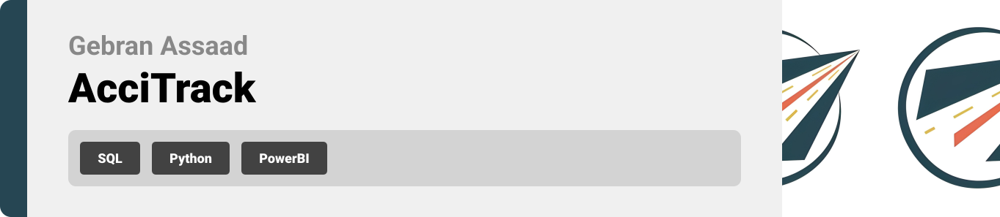

<br><br>

<!-- project philosophy -->

This project is divided into three parts:


- **ETL**: A comprehensive pipeline for extracting, transforming, and loading road accident data from multiple sources to a centralized data warehouse.
- **Data Warehouse**: Designed and implemented a scalable data warehouse to store and manage accident-related data, enabling seamless integration with analysis tools and providing authorities with organized, reliable data to aid in accident prevention.
- **Analysis**: Power BI was utilized to analyze key factors contributing to road accidents, such as weather conditions, road types, and human behavior.

### User Stories
- As a user, I want to explore a Power BI report that visualizes road accident trends, so I can understand how different factors correlate with accident frequency.
- As a user, I want to filter the Power BI report by location, weather, and time, so I can focus on accident data relevant to my area of interest

<br><br>
<!-- Tech stack -->


###  AcciTrack is built using the following technologies:

- **Python**: Python is responsible for the ETL (Extract, Transform, Load) process, automating data extraction from multiple sources, transforming it into an analyzable format, and preparing it for loading into the warehouse.
- **SQL**: SQL is used to efficiently load processed road accident data into the data warehouse, ensuring structured storage and easy access for future analysis and reporting.
- **Power BI**: Power BI is leveraged to create data visualizations and dashboards, allowing users to analyze accident trends, identify key contributing factors, and generate actionable insights to prevent future incidents.

<br><br>
<!-- UI UX 

We designed Coffee Express using wireframes and mockups, iterating on the design until we reached the ideal layout for easy navigation and a seamless user experience.
Project Figma design [figma](https://www.figma.com/file/LsuOx5Wnh5YTGSEtrgvz4l/Purrfect-Pals?type=design&node-id=257%3A79&mode=design&t=adzbABt5hbb91ucZ-1)
### Mockups
| Home screen  | Menu Screen | Order Screen |
| ---| ---| ---|
|  |  |  | -->

<br><br>

<!-- Data Warehouse Schema -->


###  Architecting Data Excellence: Innovative Database Design Strategies:

- 


<br><br>


<!-- Implementation 


### User Screens (Mobile)
| Login screen  | Register screen | Landing screen | Loading screen |
| ---| ---| ---| ---|
|  |  |  |  |
| Home screen  | Menu Screen | Order Screen | Checkout Screen |
|  |  |  |  |

### Admin Screens (Web)
| Login screen  | Register screen |  Landing screen |
| ---| ---| ---|
|  |  |  |
| Home screen  | Menu Screen | Order Screen |
|  |  |  |-->

<br><br>


<!-- Prompt Engineering -->


###  Mastering AI Interaction: Unveiling the Power of Prompt Engineering:

- This project uses advanced prompt engineering techniques to optimize the interaction with natural language processing models. By skillfully crafting input instructions, we tailor the behavior of the models to achieve precise and efficient language understanding and generation for various tasks and preferences.

<br><br>

<!-- AWS Deployment 


###  Efficient AI Deployment: Unleashing the Potential with AWS Integration:

- This project leverages AWS deployment strategies to seamlessly integrate and deploy natural language processing models. With a focus on scalability, reliability, and performance, we ensure that AI applications powered by these models deliver robust and responsive solutions for diverse use cases. -->

<br><br>

<!-- Validation -->


###  Precision in Development: Harnessing the Power of Unit Testing:

- This project employs rigorous unit testing methodologies to ensure the reliability and accuracy of code components. By systematically evaluating individual units of the software, we guarantee a robust foundation, identifying and addressing potential issues early in the development process.

<br><br>


<!-- How to run -->


> To set up AcciTrack locally, follow these steps:

### How To Set Up Your Project

To set up this project locally, follow these steps:

#### Prerequisites
- **MySQL Server 8.0** installed and configured on your machine.
  
#### Installation

1. Download the folder from the [GitHub repository](https://github.com/Gebranassaad/SEF-Final-Project).

2. Open the **Original Datasets** folder and place all files into the following directory:

   ```sh
   C:\ProgramData\MySQL\MySQL Server 8.0\Uploads
   ```

3. Next, follow these steps:

  - Open the **ETL and DataWarehouse** folder. 
  - Run `Staging Database.sql` to create the staging database.
  - Run `Staging Load.sql` to load the data into the staging tables.
  - Run `DataWarehouse.sql` to create and populate the data warehouse.


4. Finally, open the **notebook** named `transformation.ipynb` and update your MySQL credentials to link Python with MySQL. Once updated, run the code in the notebook.

5. To see the dashboard, Open the folder PowerBI then the file `AcciTrack.bpix`.

Now, your environment should be ready for use.
